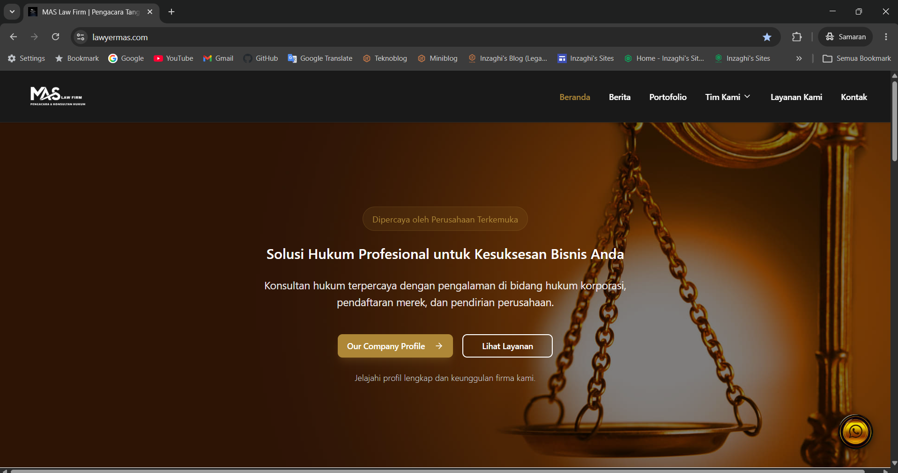

# ⚖️ Website M.A.S Law Firm

Website Resmi M.A.S Law Firm — Website Company Profile dan Layanan Hukum yang dikembangkan menggunakan teknologi web modern.



---

## 🌐 Website Live

🔗 URL Production  
https://www.lawyermas.com
https://website-kantor-pengacara-mas.vercel.app

🔗 Repository GitHub

- https://github.com/inzaghidev/MAS-Law-Firm-Website
- https://github.com/ditosatrio87-arch/lawyermass-main

---

# 📌 Tentang Project

Website M.A.S Law Firm merupakan website company profile firma hukum modern yang dikembangkan selama program magang di M.A.S Law Firm sebagai posisi **Web Developer (Full Stack)**.

Website ini dibuat untuk:

- Meningkatkan branding digital firma hukum
- Menyediakan informasi layanan hukum
- Mempublikasikan berita & artikel hukum
- Menampilkan profil perusahaan dan pengacara
- Mengelola dokumen hukum dan pengaturan website secara dinamis

---

# 🚀 Teknologi yang Digunakan

## Frontend

- React.js
- Vite
- Tailwind CSS v4
- Lucide React

## Backend & Database

- Supabase
- PostgreSQL

## Deployment & Hosting

- Vercel
- Domainesia

## Development Tools

- VS Code
- GitHub
- GitHub Copilot
- Google Antigravity

---

# 📂 Struktur Project

```
📁MAS-Law-Firm-Website/
│
├── 📁public/
│   ├── images/
│   ├── icons/
│   └── favicon/
│
├── 📁src/
│
│   ├── 📁app/
│   │   ├── App.tsx
│   │   ├── main.tsx
│   │   ├── routes/
│   │   │   └── index.tsx
│   │   └── providers/
│   │
│   ├── 📁assets/
│   │   ├── images/
│   │   ├── logos/
│   │   ├── banners/
│   │   └── fonts/
│   │
│   ├── 📁components/
│   │   ├── figma/
│   │   ├── 📁ui/
│   │   │   ├── card.tsx
│   │   │   ├── button.tsx
│   │   │   ├── modal.tsx
│   │   │   └── input.tsx
│   │   │
│   │   ├── 📁layout/
│   │   │   ├── Navbar.tsx
│   │   │   ├── Footer.tsx
│   │   │   ├── Layout.tsx
│   │   │   └── ScrollToTop.tsx
│   │   │
│   │   └── 📁common/
│   │       ├── FloatingWhatsApp.tsx
│   │       ├── WhatsAppButton.tsx
│   │       └── ProtectedRoute.tsx
│   │
│   ├── 📁features/
│   │
│   │   ├── home/
│   │   │   ├── pages/
│   │   │   │   └── Beranda.tsx
│   │   │   ├── components/
│   │   │   │   ├── HeroSection.tsx
│   │   │   │   ├── VisiMisi.tsx
│   │   │   │   └── ServicesPreview.tsx
│   │   │   └── hooks/
│   │   │
│   │   ├── berita/
│   │   │   ├── pages/
│   │   │   │   ├── Berita.tsx
│   │   │   │   └── NewsDetail.tsx
│   │   │   ├── components/
│   │   │   │   ├── NewsCard.tsx
│   │   │   │   └── NewsList.tsx
│   │   │   ├── services/
│   │   │   │   └── beritaService.ts
│   │   │   └── hooks/
│   │   │
│   │   ├── layanan/
│   │   │   ├── pages/
│   │   │   │   └── LayananKami.tsx
│   │   │   ├── components/
│   │   │   │   ├── ServiceCard.tsx
│   │   │   │   └── ConsultationCTA.tsx
│   │   │   └── services/
│   │   │
│   │   ├── team/
│   │   │   ├── pages/
│   │   │   │   ├── TimPengacara.tsx
│   │   │   │   ├── StaffKaryawan.tsx
│   │   │   │   └── Portfolio.tsx
│   │   │   ├── components/
│   │   │   │   └── TeamCard.tsx
│   │   │   └── services/
│   │   │
│   │   ├── verification/
│   │   │   ├── pages/
│   │   │   │   └── VerifyDocument.tsx
│   │   │   ├── components/
│   │   │   └── services/
│   │   │
│   │   ├── admin/
│   │   │   ├── pages/
│   │   │   │   ├── Admin.tsx
│   │   │   │   ├── Login.tsx
│   │   │   │   ├── DashboardOverview.tsx
│   │   │   │   ├── ManageNews.tsx
│   │   │   │   ├── SiteSettings.tsx
│   │   │   │   └── DocumentVerification.tsx
│   │   │   │
│   │   │   ├── components/
│   │   │   │   ├── Sidebar.tsx
│   │   │   │   ├── AdminNavbar.tsx
│   │   │   │   └── DashboardCard.tsx
│   │   │   │
│   │   │   ├── services/
│   │   │   │   ├── newsService.ts
│   │   │   │   ├── documentService.ts
│   │   │   │   └── settingsService.ts
│   │   │   │
│   │   │   └── hooks/
│   │
│   ├── 📁lib/
│   │   ├── supabase.ts
│   │   ├── axios.ts
│   │   └── helpers.ts
│   │
│   ├── 📁hooks/
│   │   ├── useAuth.ts
│   │   ├── useFetch.ts
│   │   └── useDebounce.ts
│   │
│   ├── 📁utils/
│   │   ├── formatDate.ts
│   │   ├── slugify.ts
│   │   └── constants.ts
│   │
│   ├── 📁styles/
│   │   ├── index.css
│   │   ├── tailwind.css
│   │   ├── theme.css
│   │   └── fonts.css
│   │
│   └── 📁types/
│       ├── news.ts
│       ├── document.ts
│       └── user.ts
│
├── 📁supabase/
│   ├── migrations/
│   └── seed.sql
│
├── .env
├── .gitignore
├── package.json
├── tailwind.config.js
├── vite.config.ts
├── vercel.json
└── README.md
```
