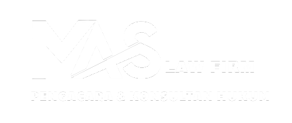

# Project MAS Law Firm Website

This is a code bundle for Project MAS Law Firm Website. The original project is available at https://www.figma.com/design/tDcdWljLw7SYYHI55zHjNH/Project-1-MAS-Law-Firm-Website.

Merupakan Project Magang Web Developer (Full Stack) M.A.S. Law Firm untuk membuat Website Kantor Pengacara Hukum. Project ini dibuat dengan Laravel, React.js, dan Tailwind CSS.

Link :
[lawyermas.com](https://lawyermas.com)

This Project is Powered by : M. Amar Syeban Law Firm

## Running the code

Run `npm i` to install the dependencies.

Run `npm run dev` to start the development server.
